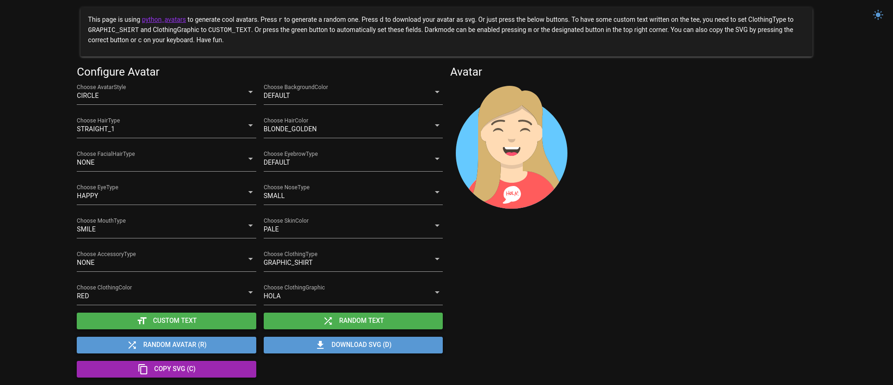

# nicegui-avatar-generator

## About
I just played around with [nicegui](https://github.com/zauberzeug/nicegui/) and wanted to generate some avatars for another project. I utilized the [python_avatars](https://github.com/ibonn/python_avatars) library to generate images in SVG format that can then be stored somewhere, downloaded or just copied to the clipboard. 
## Installation
- Install required python libraries: `pip3 install -r requirements.txt`
## Usage
- Start webserver: `python3 avatar.py`
- Open in browser: `http://localhost:8080`